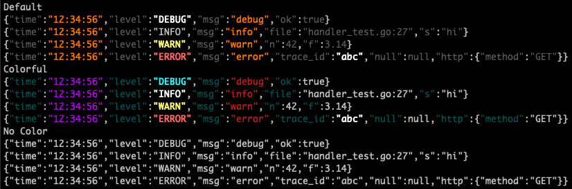

# colorjson

A Go package that provides a colorized JSON handler for the Go standard library's `slog` package.

## Features

- Pretty-prints JSON logs with syntax highlighting
- Color-coded log levels, keys, timestamps, and messages (see [Color Schemes](#color-schemes))
- Formats strings, numbers, booleans, and null values as JSON
- Supports `WithAttrs` and `WithGroup` like the standard `slog` handlers
- Respects `NO_COLOR`, `FORCE_COLOR`, and `TERM` for terminal color detection
- Implements the `slog.Handler` interface for seamless integration

## Installation

```bash
go get github.com/hydronica/color-json
```

## Usage

```go
package main

import (
	"log/slog"
	"os"

	colorjson "github.com/hydronica/color-json"
)

func main() {
	handler := colorjson.NewHandler(os.Stderr, &colorjson.HandlerOptions{
		Level:  slog.LevelDebug,
		Source: colorjson.SrcShortFile,
	})

	logger := slog.New(handler)
	slog.SetDefault(logger)

	slog.Info("Server started", "addr", ":8080")
	slog.Debug("Detailed debug message", "value", 123)
	slog.Warn("Something might be wrong", "error", "connection timeout")
	slog.Error("Critical error occurred", "error", "file not found")
}
```

## Configuration

`NewHandler` takes an `io.Writer` and an optional `*colorjson.HandlerOptions`:

| Field | Description |
|-------|-------------|
| `Level` | Minimum log level. Defaults to `slog.LevelInfo` when unset. |
| `Source` | How to include caller source in each record. See [Source formats](#source-formats). |
| `ReplaceAttr` | Rewrites each non-group attribute before it is logged. Same contract as [`slog.HandlerOptions.ReplaceAttr`](https://pkg.go.dev/log/slog#HandlerOptions). |
| `TimeFormat` | `time.Format` layout for the `time` field. Defaults to `time.TimeOnly` (`"15:04:05"`). Use `time.RFC3339` or `time.DateOnly` for other layouts. |
| `Colors` | Color preset or custom scheme. Defaults to `ColorDefault`. See [Color Schemes](#color-schemes). |

Pass `nil` for options to use defaults (`ColorDefault`, `time.TimeOnly`, level `INFO`).

### Source formats

Set `Source` to include caller information in each log line:

| Constant | Output shape |
|----------|--------------|
| `SrcFull` | `{"source":{"function":"pkg.Func","file":"/path/file.go","line":42}}` |
| `SrcShortFile` | `{"file":"file.go:42"}` — like `log.Lshortfile` |
| `SrcLongFile` | `{"file":"/path/file.go:42"}` — like `log.Llongfile` |

Omit `Source` (zero value) to leave source fields out of the output.

### WithAttrs and WithGroup

The handler implements `slog.Handler` fully, matching the standard library semantics:

- **`WithAttrs`** — attributes are written on every subsequent record and highlighted with the `Persistent` color from the active scheme. If `WithGroup` was called first, persistent attributes are nested inside that group.
- **`WithGroup`** — record attributes are nested under the group name in the JSON output. Groups can be nested. Calling `WithAttrs` before `WithGroup` keeps those attributes at the top level.

```go
logger := slog.New(handler).With("service", "api").WithGroup("http")
logger.Info("request", "method", "GET", "status", 200)
// {"time":"12:34:56","level":"INFO","msg":"request","service":"api","http":{"method":"GET","status":200}}

httpLogger := slog.New(handler).WithGroup("http").With("method", "GET")
httpLogger.Info("request", "status", 200)
// {"time":"12:34:56","level":"INFO","msg":"request","http":{"method":"GET","status":200}}
```

## Color Schemes

Three built-in presets are available via `HandlerOptions.Colors`:

```go
handler := colorjson.NewHandler(os.Stderr, &colorjson.HandlerOptions{
	Colors: colorjson.ColorDefault, // or Colorful, NoColor
})
```

The screenshot below shows the same sample lines for each preset (from `go test -run TestOutput`):



To see live colors in your terminal:

```bash
env -u NO_COLOR FORCE_COLOR=1 go test -run TestOutput -v
```

### ColorDefault

Gray keys and values, orange time and message, yellow warnings, red errors.

### Colorful

Teal keys, purple time, red message, yellow warnings, red errors.

### NoColor

Plain JSON with no ANSI escape codes — useful for file output or when `NO_COLOR` is set.

Persistent attributes from `WithAttrs` use bright white in both `ColorDefault` and `Colorful`.

### Custom colors

Start from a preset and override individual fields on the `Colors` struct. Each field is a `TerminalColor` (an ANSI escape sequence string):

```go
colors := colorjson.ColorDefault
colors.LevelError = colorjson.TerminalColor("\033[41m\033[37m") // white on red background

handler := colorjson.NewHandler(os.Stderr, &colorjson.HandlerOptions{
	Colors: colors,
})
```

Available `Colors` fields: `Key`, `Default`, `Message`, `DateTime`, `Persistent`, `LevelInfo`, `LevelDebug`, `LevelWarn`, `LevelError`.

## Terminal Support

The handler automatically detects whether the terminal supports color. Colors are disabled when:

- `NO_COLOR` is set (see [no-color.org](https://no-color.org/))
- `TERM` is empty or set to `dumb`

Set `FORCE_COLOR` to enable colors even when the terminal would otherwise be treated as non-color.

When color is disabled, output is plain JSON with no ANSI escape codes.

## License

GNU General Public License v3.0
